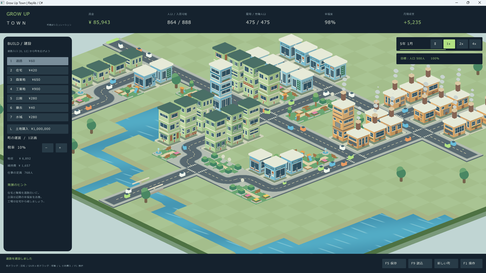
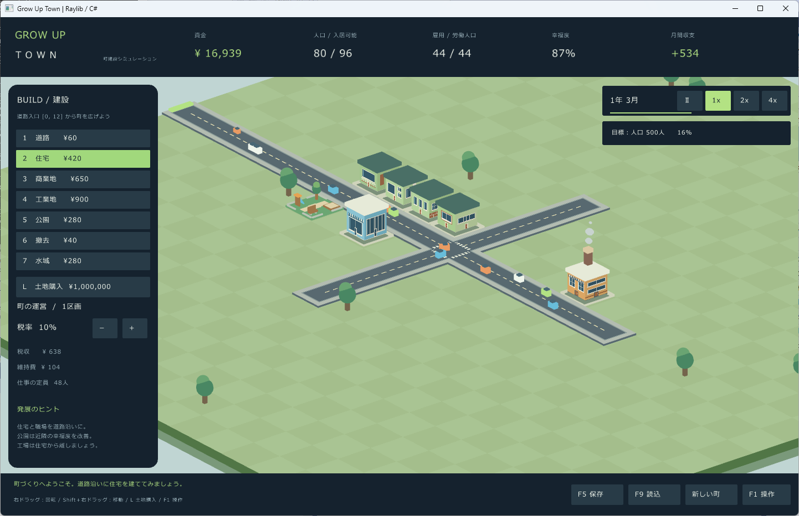

# Grow Up Town

小さな町を、大きな暮らしへ。

**Grow Up Town** は、道路を引き、住宅や職場を建てながら町を育てる、3D見下ろし型の町建設シミュレーションです。住民の暮らしと町の収支を見守りながら、人口500人を目指しましょう。目標を達成した後も、自由に町づくりを続けられます。

公園を並べて緑豊かな住宅街にしたり、川や池をつくって橋を架けたり。建物が成長し、道路を車が行き交う町を、好きな角度から眺めるのも楽しみのひとつです。



## ゲームの特徴

- **道路から始まる町づくり**：住宅・商業地・工業地を配置し、住まいと仕事のバランスを整えます。
- **暮らしに合わせて建物が成長**：通常建物は最大レベル3、super建築物は6、ultra複合都市は9まで自動で増築。さまざまな壁面や窓が町並みを彩ります。
- **年月とともに広がる建設メニュー**：大型の住宅や複合ビル、大公園、スーパーマーケット、物流センターが順に解放されます。
- **公園と水辺で景観づくり**：隣り合う公園は園路がつながり、水域を並べれば川や池になります。
- **税率と収支のシンプルな運営**：税収を次の建設に使いながら、維持費と住民の幸福度に気を配ります。
- **土地を購入して町を拡張**：資金を蓄えて隣の区画へ。人口500人を超えても発展を楽しめます。

## 起動方法

Windows x64向けのゲームです。日本語表示にはWindowsのメイリオ、または游ゴシックを使用します。

配布用の `GrowUpTown.zip` を入手した場合は、ZIPの内容をすべて展開し、フォルダー内の `GrowUpTown.exe` を起動してください。同梱ファイルは同じフォルダーに置いたままにします。配布版には.NETの実行環境が含まれています。

以下のスクリーンショットは以前のバージョンの画面です。現在は建設メニューや情報表示が増えています。

ソースコードから起動する方法は、[開発・ビルド向けの説明](src/README.md)を参照してください。

## はじめての町づくり

最初は24×24マスの土地と16,000円の資金からスタートします。住宅4棟、商業地、工場、公園、町の外へつながる道路がすでにあるので、そこから少しずつ広げてみましょう。



1. **いったん時間を止める**：`Space` キーで一時停止すると、落ち着いて配置を考えられます。停止中も建設できます。
2. **道路を延ばす**：左の「道路」ボタン、または `1` キーで道路を選び、既存の道路からつなげます。ドラッグで連続配置できます。
3. **道路沿いに住宅と職場を建てる**：住宅だけでなく、商業地や工業地も用意します。工場は住宅から離して配置すると住環境を保ちやすくなります。
4. **公園や水辺を添える**：住宅の近くに置くと住環境が改善します。公園は道路につなげましょう。
5. **時間を進めて様子を見る**：`Space` キーで再開し、人口・幸福度・月間収支を確認します。通常速度では5秒で1か月進みます。
6. **こまめに保存する**：`F5` キーで保存します。自動保存はありません。

## 画面の見方

| 表示 | 確認できること |
| --- | --- |
| 資金 | 建設や維持費に使えるお金 |
| 人口 / 入居可能 | 現在の住民数と、道路につながった住宅の定員 |
| 雇用 / 労働人口 | 働いている人数と、仕事を必要とする人数 |
| 幸福度 | 町全体の暮らしやすさ。入居や建物の成長に影響 |
| 月間収支 | 直近の月の税収から維持費を引いた金額 |
| 左側の運営欄 | 税率、税収、維持費、仕事の定員 |
| 右上 | 年月、時間の停止・速度切り替え、人口目標の達成率 |
| 今、町に必要なもの | 住宅・職場の不足、成長に必要な労働者数、道路接続や幸福度についての案内 |

マップ上のマスにマウスを合わせると、建物の種類やレベル、道路接続の状態を確認できます。住宅では住民数と住環境も表示されます。

「今、町に必要なもの」は、建設・撤去・月の経過・読込に応じて更新されます。住宅に十分な空きがあるのに労働者が不足している場合は、人口の増加を待ちましょう。住宅の定員自体が足りなければ、住宅を追加します。

`F2` で左の建設・運営パネル、`F3` で右の情報パネルを表示・非表示にできます。`Tab` で両方をまとめて隠し、両方が非表示なら再表示します。上部の表示ボタンからも戻せます。パネルを隠した場所でも建設やカメラ操作ができ、ショートカットキーも使えます。再起動時は両方表示されます。

## 建設メニュー

以下は開始時から使える通常の施設です。費用は1マスあたりです。住宅・商業地・工業地の維持費と定員は、建物のレベルに比例して増えます。

| キー | 種類 | 建設・撤去費 | 毎月の維持費 | 役割 |
| --- | --- | ---: | ---: | --- |
| `1` | 道路 | 60円 | 2円 | 町の入口と建物をつなぐ |
| `2` | 住宅 | 420円 | 5円 × レベル | 24人 × レベルが入居可能 |
| `3` | 商業地 | 650円 | 8円 × レベル | 16人 × レベルの職場 |
| `4` | 工業地 | 900円 | 14円 × レベル | 32人 × レベルの職場。周辺の住環境を下げる |
| `5` | 公園 | 280円 | 12円 | 道路につなぐと周辺の住環境を改善 |
| `6` | 撤去 | 40円 | — | 建物・道路・公園・水域を空き地に戻す |
| `7` | 水域 | 280円 | 12円 | 川や池をつくり、周辺の住環境を改善 |

左側のボタンでも種類を選べます。選択後、マップを左クリックすると建設・撤去します。道路と水域は左ドラッグで連続配置できます。

既存の建物を別のものに変えるときは、先に撤去してください。例外として、水域には直接道路を建設できます。撤去しても建設費は返金されません。

### 年月による解放

開始時は1年1月です。次の施設は、画面に表示される年数を基準に、その年の1月から建設できます。

| 解放時期 | 使えるようになる施設 |
| --- | --- |
| 5年1月 | super住宅商業地・super工業地・super工業商業地・super住宅地 |
| 10年1月 | ultra複合都市 |
| 15年1月 | スペシャル（大公園・スーパーマーケット・物流センター） |

解放前の項目は「？」「¥？」と表示され、クリックやショートカットキーで選択できません。解放状態は保存した年月から引き継ぎ、新しい町を始めると再び開始時の状態になります。以前のセーブに解放前の施設があっても、その施設は稼働・成長・撤去できます。

### 大型建築：super・ultra

表の建設費は1棟全体の価格です。入居定員・雇用・毎月の維持費は、いずれも1レベルあたりの値で、レベルに比例して増えます。

| キー | 建築物 | 必要な空き地 | 建設費 | 入居定員 | 雇用 | 維持費/月 | 最大レベル |
| --- | --- | --- | ---: | ---: | ---: | ---: | ---: |
| `8` | super住宅商業地 | 2×2マス | 4,280円 | 96人 | 64人 | 52円 | 6 |
| `9` | super工業地 | 2×2マス | 3,600円 | — | 128人 | 56円 | 6 |
| `0` | super工業商業地 | 2×2マス | 6,200円 | — | 192人 | 88円 | 6 |
| `T` | super住宅地 | 2×2マス | 4,800円 | 192人 | — | 40円 | 6 |
| `U` | ultra複合都市 | 3×3マス | 18,000円 | 432人 | 240人 | 150円 | 9 |

super住宅商業地は住まいと店舗を兼ねた複合ビル、super工業地は大工場、super工業商業地は生産と商業・流通の複合ビルです。super住宅地は住宅専用のタワーマンションで、雇用枠はありません。

ultra複合都市は住宅・商業・工業をまとめたSF都市ビルです。最大レベル9で入居定員3,888人、雇用2,160人になります。super工業地・super工業商業地は周辺住宅の住環境を下げますが、ultra複合都市は公害を出しません。ただし、住宅部分は他の工場の公害を受けます。

大型施設は、クリックしたマスから座標のX・Zが増える方向に広がります。配置予定の枠を確認し、全体が購入済みの空き地に収まる場所へ建設してください。購入済みなら区画境界をまたいでも設置できます。外周のどこかが入口につながる道路に隣接すれば、1棟全体が稼働します。占有するマスのどこを撤去しても、**40円で1棟全体が撤去**されます。

### スペシャル施設

15年1月以降、左の「スペシャル」ボタンから専用の選択ウィンドウを開き、施設を選びます。選択ウィンドウを開いている間は時間と町の操作が止まります。施設を選ぶか、「閉じる」または `Esc` で戻ります。

各施設は4×4マスの空き地が必要で、レベル1固定です。大型建築と同様に区画境界をまたいで建設でき、40円で全体を撤去できます。

| 施設 | 建設費 | 維持費/月 | 雇用 | 周辺への効果 |
| --- | ---: | ---: | ---: | --- |
| 大公園 | 5,600円 | 120円 | — | 住宅の住環境を道路接続時＋20、未接続時＋6 |
| スーパーマーケット | 7,200円 | 160円 | 64人 | 道路接続時、住宅の住環境＋10、商業部分の税収基準額＋20% |
| 物流センター | 8,400円 | 180円 | 96人 | 道路接続時、工業・商業部分の税収基準額＋20%。公害なし |

周辺効果は施設の外周から縦横の合計距離5マス以内に届き、super・ultraの該当する用途にも適用されます。対象も大型建築なら、その外周までの最短距離で判定します。雇用や税収には入口につながる道路への接続が必要です。

同じ種類のスーパーマーケットや物流センターを複数置いても、効果は重複しません。両方の範囲に入った商業部分は、元の税収基準額に対して合計＋40%になります。スペシャル施設自身には税収ボーナスが付きません。実際の税収は、町の稼働率と税率でも変わります。

大公園・スーパーマーケット・物流センターにはそれぞれ16種類の外観があります。設置時に周囲に合わせて選ばれ、その後は外観と向きが固定されます。

## 町を発展させるには

### 道路を町の入口につなぐ

町の入口は、**最初の土地の西側にある座標 `[0, 12]` の道路**です。そこまで途切れずにつながる道路に、建物が上下左右のいずれかで隣接していると稼働します。斜めにつながっているだけでは使えません。

赤い枠の建物は道路未接続です。入口から建物までの道路を確認しましょう。土地を拡張した後も入口の位置は変わりません。

### 住宅と仕事をバランスよく増やす

住民の55%が労働人口になります。住宅に空きがあっても、職場が不足すると人口は伸びにくくなります。「雇用 / 労働人口」と「仕事の定員」を見ながら、住宅と職場を少しずつ増やしましょう。

条件が整った通常住宅には、1棟につき最大4人が毎月入居します。大型住宅部分の入居は、super住宅商業地で最大16人/月、super住宅地で32人/月、ultra複合都市で72人/月です。道路が切れたり、町の幸福度や住宅の住環境が悪化したりすると、住民が転出することもあります。

### 幸福度を保つ

通常住宅から縦横の移動で合計3マス以内にある公園や水域は、住環境を改善します。通常公園は道路接続時に1マスあたり＋10、未接続でも＋3の効果があります。水域は道路接続なしで1マスあたり＋10です。同じ範囲の工場は住環境を下げます。大公園やスーパーマーケットの効果を含めて、住環境の上限は＋25です。

高い税率、失業、資金の赤字も幸福度を下げる原因です。税率は左側の `−` / `＋` ボタンで5〜20%に調整できます。増税するときは、収入だけでなく幸福度の変化も見守りましょう。

### 建物の成長を待つ

通常建物とsuper・ultraの建築物は、道路につながり、幸福度60%以上を保ち、それぞれの条件を**6か月連続**で満たすと1レベル成長します。最大レベルは通常建物が3、superが6、ultraが9です。スペシャル施設は成長しません。

- 住宅を含む建物：入居定員の5/6以上が入居していること。通常住宅では現在のレベル × 20人以上です。
- 住宅を含まない商業・工業の建物：町の労働人口が、仕事の定員の55%以上あること。

成長すると入居定員や仕事の定員が増えますが、維持費も増えます。

### 収支を見ながら建てる

毎月、住民税と商業・工業の稼働状況に応じた税収が入り、道路や建物などの維持費が差し引かれます。道路に未接続の建物にも維持費はかかるため、使われていない施設を増やしすぎないようにしましょう。

資金がマイナスになってもゲームオーバーにはならず、時間は進みます。ただし、建設や撤去にはそれぞれの費用が必要です。

## 公園・川・橋をつくる

公園を上下左右に並べると芝生と園路がつながります。林、花壇、噴水、遊具などの装飾で、まとまった緑地をつくれます。

通常公園と大公園が上下左右につながっていれば、どこかが入口へ続く道路に面するだけで、ひと続きの公園全体が道路接続済みになります。園路は道路や大公園の方向にも伸びますが、入口につながっているかは接続表示で確認してください。公園経由の接続は住宅や職場、別の道路網には伝わりません。

水域は細く並べると川、広く並べると池になります。川を横切る道路をつくり、道路が直線につながっていて、その両脇が水域になっていると、自動で橋の見た目になります。

例えば東西に橋を架ける場合は、道路を東西につなぎ、各道路マスの北側と南側に水域を配置します。橋に追加の建設費・維持費はかかりません。**水域の上に建てた道路を撤去しても水域には戻らず、空き地になります。**

車は町の景観を楽しむための演出です。入口につながっていない道路にも現れるため、車の有無ではなく建物の接続表示で道路を確認してください。

## 土地を広げる

`L` キー、または「土地購入」ボタンで土地購入モードに入ります。所有地の上下左右に接する未購入の区画をクリックし、確認画面から購入してください。

- 1区画は24×24マスです。価格は初回 **1,000,000円**、2回目1,500,000円、3回目2,000,000円と、購入のたびに500,000円ずつ上がります。
- 最初から所有する区画は購入回数に含みません。購入のキャンセル・失敗では価格は上がらず、保存・読込後も次の価格を引き継ぎます。
- 斜めにしか接していない区画は購入できません。
- 購入した土地は売却できません。
- 区画数にゲーム上の固定上限はありませんが、拡張できる規模はPCのメモリなどにも左右されます。

画面外の町も発展しますが、更新はまとめて行われるため、ずっと表示していた場合と成長の結果が異なることがあります。

## 操作一覧

### 建設・町の運営

| 操作 | 内容 |
| --- | --- |
| `1`〜`7` / 左の建設ボタン | 建設・撤去ツールを選択 |
| `8` / `9` / `0` / `T` | super住宅商業地 / super工業地 / super工業商業地 / super住宅地を選択（5年から） |
| `U` | ultra複合都市を選択（10年から） |
| 「スペシャル」ボタン | 大公園・スーパーマーケット・物流センターを選択（15年から） |
| 左クリック | 建設・撤去 |
| 左ドラッグ | 道路・水域の連続配置 |
| `L` | 土地購入モードの切り替え |
| `Esc` | 選択を解除、ダイアログや土地購入モードを閉じる |
| `Space` | 時間の停止・再開（再開時は1倍速） |
| 右上の速度ボタン | 停止 / 1倍速 / 2倍速 / 4倍速 |
| 税率の `−` / `＋` | 税率を変更 |
| `F5` / 「保存」 | 町を保存 |
| `F9` / 「読込」 | 保存した町を読み込む |
| `F1` / 「操作」 | ゲーム内の操作説明を表示 |
| `F2` / 上部の建設表示ボタン | 左の建設・運営パネルを表示・非表示 |
| `F3` / 上部の情報表示ボタン | 右の情報パネルを表示・非表示 |
| `Tab` | 両パネルを隠す。両方非表示なら再表示 |

### カメラ・画面

| 操作 | 内容 |
| --- | --- |
| `WASD` / 矢印キー | カメラを移動 |
| 中ボタンドラッグ | カメラを移動 |
| `Shift` + 右ドラッグ | カメラを移動 |
| 右ドラッグ | 左右で回転、上下で見下ろす角度を変更 |
| `Q` / `E` | カメラを回転 |
| `R` / `F` | 見下ろす角度を上げる / 下げる |
| `Shift` + ホイール | 見下ろす角度を調整 |
| ホイール | 拡大・縮小 |
| `Home` | カメラの位置・回転・角度・倍率を初期状態に戻す |
| `Alt` + `Enter` | 枠なし全画面とウィンドウ表示を切り替え |

マウスでカメラを操作するときは、マップ上からドラッグを始めてください。右ドラッグの移動・回転は、ドラッグ開始時に `Shift` を押しているかで決まります。

## 保存とゲームの続き

**自動保存はありません。終了前には `F5` キーで保存してください。** 保存は1スロットで、毎回上書きされます。次に起動したら `F9` キーで保存した町を読み込めます。読込時には、現在の未保存の町の状態が置き換わります。

保存先は、配布版・Release実行時では **`GrowUpTown.exe` と同じフォルダーの `city.json`** です。起動時の作業フォルダーには依存しません。バックアップしたい場合は、このファイルを別の場所にコピーしてください。

```text
GrowUpTown/
├─ GrowUpTown.exe
└─ city.json
```

Debug実行時は、`src/GrowUpTown.sln` と同じフォルダー内の `SaveData/city.json`（このリポジトリでは `src/SaveData/city.json`）に保存されます。

以前のバージョンの `%LOCALAPPDATA%\GrowUpTown\city.json` を使う場合は、そのファイルを新しい保存先へ手動でコピーしてから読み込んでください。自動移行はありません。

「新しい町」ボタンを押すと確認画面が開きます。新しく始めても保存ファイルは消えませんが、その後 `F5` キーで保存すると上書きされます。

現在の保存形式はVersion 3です。旧形式（Version 1・2）のセーブデータは読み込めません。

## 困ったときは

| 状況 | 確認すること |
| --- | --- |
| 建物に赤い枠が付く | 入口 `[0, 12]` から続く道路に、建物が上下左右で隣接しているか確認してください。 |
| 人口が増えない | 時間が動いているか、住宅の空きと職場があるか、道路接続・幸福度・住環境に問題がないか確認してください。 |
| 建物が成長しない | 幸福度60%以上と入居・雇用の条件を6か月連続で満たす必要があります。通常はレベル3、superは6、ultraは9が上限です。スペシャル施設はレベル1固定です。 |
| 建設できない | 解放時期、資金、購入済みの土地、施設全体を置ける空き地を確認してください。既存施設は原則として先に撤去します。 |
| メニューが「？」になっている | superは5年、ultraは10年、スペシャルは15年の1月に解放されます。 |
| 左右のパネルが見えない | `F2`・`F3` または上部の表示ボタンで戻せます。両方隠れている場合は `Tab` でも戻せます。 |
| 町が見つからない / 視点を戻したい | `Home` キーで最初のカメラ位置に戻せます。 |
| 前回の町が表示されない | 新しい保存先に `city.json` があるか確認し、`F9` キーで読み込んでください。旧バージョンの保存は手動コピーが必要です。前回保存していない進行は復元できません。 |
